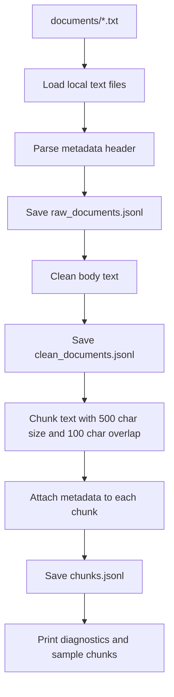

# Project 1 Planning: The Unofficial Guide

> Write this document before you write any pipeline code.
> Your spec and architecture diagram are what you'll use to direct AI tools (Claude, Copilot, etc.) to generate your implementation — the more specific they are, the more useful the generated code will be.
> Update the Retrieval Approach and Chunking Strategy sections if you change your approach during implementation.
> Update this file before starting any stretch features.

---

## Domain

<!-- What domain did you choose? Why is this knowledge valuable and hard to find through official channels? -->
I chose Rutgers New Brunswick off-campus housing for graduate and newly admitted students.

This knowledge is valuable because choosing where to live affects cost, commute, safety, and quality of life — decisions that strongly shape the grad school experience. Official Rutgers pages cover listings and policy, but they rarely capture lived student experience (which neighborhoods feel safe, what rent is realistic, which Facebook groups actually work).

This is hard to find through official channels because the most useful advice is scattered across Reddit threads, student forums, and third-party listing sites, with no single authoritative, up-to-date guide.

---

## Documents

<!-- List your specific sources: URLs, subreddit names, forum threads, or file descriptions.
     Aim for at least 10 sources that together cover different subtopics or perspectives within your domain. -->

| # | Source | Description | URL or location |
|---|--------|-------------|-----------------|
| 1 | Rutgers Off-Campus Housing Listings | Official Rutgers marketplace for apartments and houses near Rutgers New Brunswick. Useful for rental availability, locations, and landlord-facing info. | https://offcampushousing.rutgers.edu/listing?utm_source=chatgpt.com |
| 2  | Rutgers Off-Campus Living FAQ | Official Rutgers FAQ covering leases, utilities, deposits, tenant rights, legal bedrooms, and financial aid questions. | https://offcampushousing.rutgers.edu/listing?utm_source=chatgpt.com |
| 3  | Ultimate Guide to Off-Campus Housing, r/rutgers | Student-written Reddit guide with practical advice about parking, neighborhoods, and housing search strategy. | https://www.reddit.com/r/rutgers/comments/1qrdqp1/ultimate_guide_to_offcampus_housing/?utm_source=chatgpt.com |
| 4  | Off campus housing, r/rutgers | Reddit thread with student advice on Facebook groups, Places4Students, and cheaper housing areas like Cook/Douglass. | https://www.reddit.com/r/rutgers/comments/1heci5s/off_campus_housing/?utm_source=chatgpt.com |
| 5  | Steps for finding off-campus housing, r/rutgers | Reddit thread from a student asking how to start the off-campus housing search, useful for beginner questions. |  https://www.reddit.com/r/rutgers/comments/192623z/can_someone_please_teach_metell_me_the_steps_on/?utm_source=chatgpt.com |
| 6  | Safe Off Campus Housing, r/rutgers | Reddit thread focused on safety and choosing areas near Rutgers, especially useful for international or first-time renters. | https://www.reddit.com/r/rutgers/comments/13v20td/safe_off_campus_housing/?utm_source=chatgpt.com |
| 7  | How expensive is it to live off campus in NJ?, r/rutgers | Reddit thread discussing student perceptions of off-campus cost around Rutgers. | https://www.reddit.com/r/rutgers/comments/pir337/how_expensive_is_it_to_live_off_campus_in_nj/?utm_source=chatgpt.com |
| 8  | Good apartments near Rutgers NB for grad students, r/rutgers | Reddit thread focused on apartment recommendations for graduate students and working students. | https://www.reddit.com/r/rutgers/comments/1ef50p3/whatre_some_good_apartments_near_rutgers_nb_for/?utm_source=chatgpt.com |
| 9  | Rutgers University Off-Campus Housing, RentCollegePads       | Rental search page with average rent figures and apartment listings near Rutgers. | https://www.rentcollegepads.com/off-campus-housing/rutgers/search?utm_source=chatgpt.com |
| 10 | On-campus vs. off-campus, College Confidential               | Older but useful discussion comparing social and adjustment tradeoffs between on-campus and off-campus living. | https://talk.collegeconfidential.com/t/on-campus-vs-off-campus/1457546?utm_source=chatgpt.com |

---

## Chunking Strategy

<!-- How will you split documents into chunks?
     State your chunk size (in tokens or characters), overlap size, and explain why those
     numbers fit the structure of your documents.
     A review-heavy corpus warrants different chunking than a long FAQ. -->
**Chunk size:** 500 characters (~120 tokens)

**Overlap:** 100 characters (~20% overlap)

**Reasoning:** My corpus mixes short Reddit comments (often 1–3 sentences) with longer student guides and official FAQ sections. At 500 characters, a single chunk can usually hold one complete Reddit comment or one FAQ question-and-answer pair without cutting mid-sentence. That size is large enough for opinion-based text ("Cook/Douglass is cheaper," "use Places4Students") to stay self-contained so semantic search can retrieve it on its own.

I chose 100-character overlap because key facts often span adjacent text — for example, a parent post asking about safe areas and a reply naming specific neighborhoods. Overlap increases the chance that at least one chunk contains both the topic and the answer. I will preprocess documents by stripping HTML, normalizing whitespace, and keeping source metadata (URL, subreddit, thread title) attached to each chunk.

Chunks would be **too small** (e.g., 100 characters) if retrieval returned sentence fragments like "Cook/Douglass" without context — the LLM could not explain *why* students recommend that area. They would be **too large** (e.g., 1,500+ characters) if a single chunk mixed unrelated Reddit comments from different threads, causing off-topic retrieval (e.g., returning parking advice when the question is about rent). I will monitor this during evaluation by checking whether retrieved chunks contain a complete, attributable claim.

---

## Retrieval Approach

<!-- Which embedding model are you using (e.g., all-MiniLM-L6-v2 via sentence-transformers)?
     How many chunks will you retrieve per query (top-k)?
     If you were deploying this for real users and cost wasn't a constraint, what tradeoffs
     would you weigh in choosing a different embedding model — context length, multilingual
     support, accuracy on domain-specific text, latency? -->

**Embedding model:** `all-MiniLM-L6-v2` via `sentence-transformers` (local, no API cost)

**Top-k:** 5 chunks per query

**Production tradeoff reflection:** Five chunks gives the LLM enough context for multi-part questions (e.g., cost + location + safety) without flooding the prompt with irrelevant Reddit noise. Too few (k=1–2) risks missing complementary comments from different threads; too many (k=10+) dilutes the context window and can pull in tangential discussions (e.g., on-campus vs. off-campus social life when the user asked about lease deposits).

Semantic search works here because embeddings capture meaning, not just keywords — a query like "affordable neighborhoods for grad students" can match chunks that say "Cook/Douglass is cheaper" even without the word "affordable." `all-MiniLM-L6-v2` is a good default for short English student reviews: fast, runs locally, and strong on general semantic similarity.

If cost were not a constraint for production, I would weigh: **accuracy on informal student language** (e.g., `bge-large-en-v1.5` or a hosted model like Voyage for better nuance on slang and abbreviations); **context length** (longer models or chunking strategies for full FAQ pages); **multilingual support** (important for international students asking in non-English); **latency** (local MiniLM vs. API round-trips at query time); and **freshness** (re-embedding when new Reddit threads are added each semester).

---

## Evaluation Plan

<!-- List your 5 test questions with their expected correct answers.
     Questions should be specific enough that you can judge whether the system's response
     is right or wrong. "What are good dining halls?" is too vague.
     "What do students say about wait times at [dining hall name] during lunch?" is testable. -->

| # | Question | Expected answer |
|---|----------|-----------------|
| 1 | What areas near Rutgers New Brunswick do students mention as cheaper options for off-campus housing? | Students commonly point to areas around Cook/Douglass as relatively cheaper compared to closer-to-campus options; answers should reference student-reported cost tradeoffs, not just official listing prices. |
| 2 | What platforms or resources do Rutgers students recommend for finding off-campus housing? | Students recommend a mix of unofficial channels (Facebook housing groups, Reddit threads, Places4Students) and official resources (Rutgers off-campus housing portal / listing site). The answer should name multiple specific platforms, not just "search online." |
| 3 | What safety-related advice do students give about choosing off-campus housing near Rutgers? | The system should summarize student concerns about neighborhood safety, proximity to campus/bus routes, and checking areas before signing — grounded in the "safe off-campus housing" thread and related comments, with clear attribution. |
| 4 | How expensive do students say it is to live off campus around Rutgers New Brunswick? | The answer should reflect student perceptions from discussion threads (rent ranges, comparisons to on-campus costs, NJ cost-of-living context) rather than a single official number; it should note that costs vary by location, apartment size, and number of roommates. |
| 5 | What apartment complexes or housing options do grad students recommend near Rutgers NB? | The system should pull specific complex names or areas mentioned in the grad-student-focused Reddit thread (and related comments), along with any noted pros/cons (price, distance to campus, parking, quiet vs. social). |

---

## Anticipated Challenges

<!-- What could go wrong? Name at least two specific risks with reasoning.
     Consider: noisy or inconsistent documents, missing source attribution, off-topic
     retrieval, chunks that split key information across boundaries. -->

1. **Contradictory student opinions:** Reddit threads often disagree (e.g., one student calls an area affordable/safe, another warns against it). Retrieval may return both views, and the LLM could blend them into a single misleading recommendation. I will need grounding instructions that present multiple perspectives and cite sources rather than picking one answer.

2. **Chunk boundaries splitting context across posts:** In Reddit threads, the question is in the original post and the useful answer is in a reply. Fixed-size chunking can separate them, so retrieval returns a chunk with the question but not the answer (or vice versa). Overlap and keeping parent-comment pairs together during ingestion will help, but this remains a likely failure mode for beginner "how do I start?" questions.

3. **Noisy or thin official sources:** Listing pages and rental aggregators may have sparse descriptions compared to Reddit narrative text, so retrieval might over-weight anecdotal comments and under-represent official lease/tenant-rights FAQ content unless chunk metadata and diversity of sources are preserved.

---

## Architecture

<!-- Draw a diagram of your pipeline showing the five stages:
     Document Ingestion → Chunking → Embedding + Vector Store → Retrieval → Generation
     Label each stage with the tool or library you're using.
     You can use ASCII art, a Mermaid diagram, or embed a sketch as an image.
     You'll use this diagram as context when prompting AI tools to implement each stage. -->

---

## AI Tool Plan

<!-- For each part of the pipeline below, describe:
     - Which AI tool you plan to use (Claude, Copilot, ChatGPT, etc.)
     - What you'll give it as input (which sections of this planning.md, which requirements)
     - What you expect it to produce
     - How you'll verify the output matches your spec

     "I'll use AI to help me code" is not a plan.
     "I'll give Claude my Chunking Strategy section and ask it to implement chunk_text()
     with my specified chunk size and overlap" is a plan. -->

**Milestone 3 — Ingestion and chunking:**

- **Tool:** Claude (Cursor)
- **Input:** My Documents table (URLs and source types), Chunking Strategy section (500 chars, 100 overlap), and project instructions for Milestone 3
- **Expected output:** Functions to load text from saved documents/ files (Reddit exports, FAQ text, scraped page text), preprocess HTML/whitespace, and implement `chunk_text()` with my specified size and overlap; each chunk should carry `source`, `url`, and `chunk_id` metadata
- **Verification:** Run chunking on 2–3 sample documents and manually inspect that Reddit comments and FAQ Q&A pairs are not cut mid-sentence; confirm chunk count is reasonable and metadata is preserved

**Milestone 4 — Embedding and retrieval:**

- **Tool:** Claude (Cursor)
- **Input:** Retrieval Approach section (all-MiniLM-L6-v2, top-k=5), `requirements.txt` dependencies, and the chunked output format from Milestone 3
- **Expected output:** Code to embed chunks with `sentence-transformers`, store them in ChromaDB, and implement a `retrieve(query, k=5)` function that returns ranked chunks with similarity scores and source metadata
- **Verification:** Run 2 evaluation questions manually; check that returned chunks are on-topic (housing/cost/safety) and that top results come from the expected source threads

**Milestone 5 — Generation and interface:**

- **Tool:** Claude (Cursor)
- **Input:** Evaluation Plan questions, Groq API setup from `.env.example`, and grounding requirements (answer only from retrieved chunks, cite source URL/thread, say "I don't have enough information" when chunks are insufficient)
- **Expected output:** A `generate_answer(query, chunks)` function using Groq with a system prompt enforcing grounding, plus a simple Gradio or Streamlit query interface
- **Verification:** Run all 5 evaluation questions; compare responses to the Expected answer column and check that citations match retrieved chunk sources
